# 游戏流程图

## 1. 游戏主流程

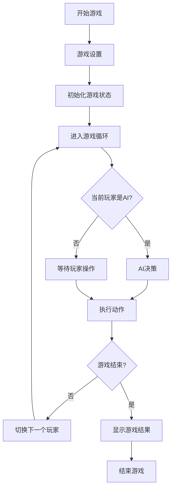
```mermaid
graph TD
    A[开始游戏] --> B[游戏设置]
    B --> C[初始化游戏状态]
    C --> D[进入游戏循环]
    D --> E{当前玩家是AI?}
    E -->|是| F[AI决策]
    E -->|否| G[等待玩家操作]
    F --> H[执行动作]
    G --> H
    H --> I{游戏结束?}
    I -->|否| J[切换下一个玩家]
    J --> D
    I -->|是| K[显示游戏结果]
    K --> L[结束游戏]
```

## 2. 玩家操作流程

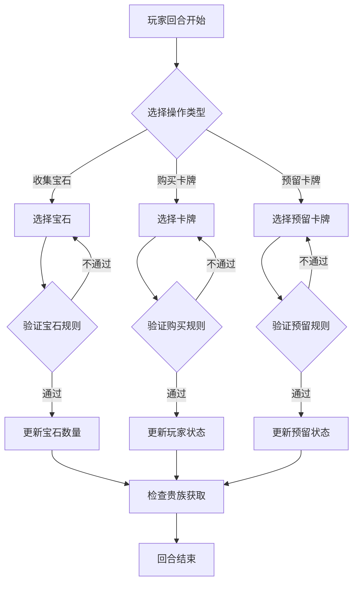
```mermaid
graph TD
    A[玩家回合开始] --> B{选择操作类型}
    B -->|收集宝石| C[选择宝石]
    B -->|购买卡牌| D[选择卡牌]
    B -->|预留卡牌| E[选择预留卡牌]
    
    C --> F{验证宝石规则}
    F -->|通过| G[更新宝石数量]
    F -->|不通过| C
    
    D --> H{验证购买规则}
    H -->|通过| I[更新玩家状态]
    H -->|不通过| D
    
    E --> J{验证预留规则}
    J -->|通过| K[更新预留状态]
    J -->|不通过| E
    
    G --> L[检查贵族获取]
    I --> L
    K --> L
    
    L --> M[回合结束]
```

## 3. AI决策流程

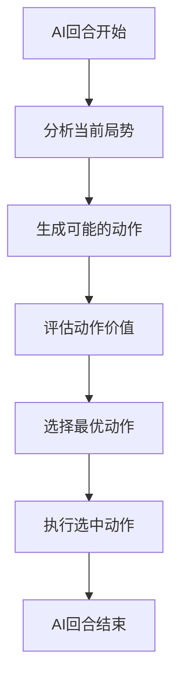
```mermaid
graph TD
    A[AI回合开始] --> B[分析当前局势]
    B --> C[生成可能的动作]
    C --> D[评估动作价值]
    D --> E[选择最优动作]
    E --> F[执行选中动作]
    F --> G[AI回合结束]
```

## 4. 游戏状态管理流程

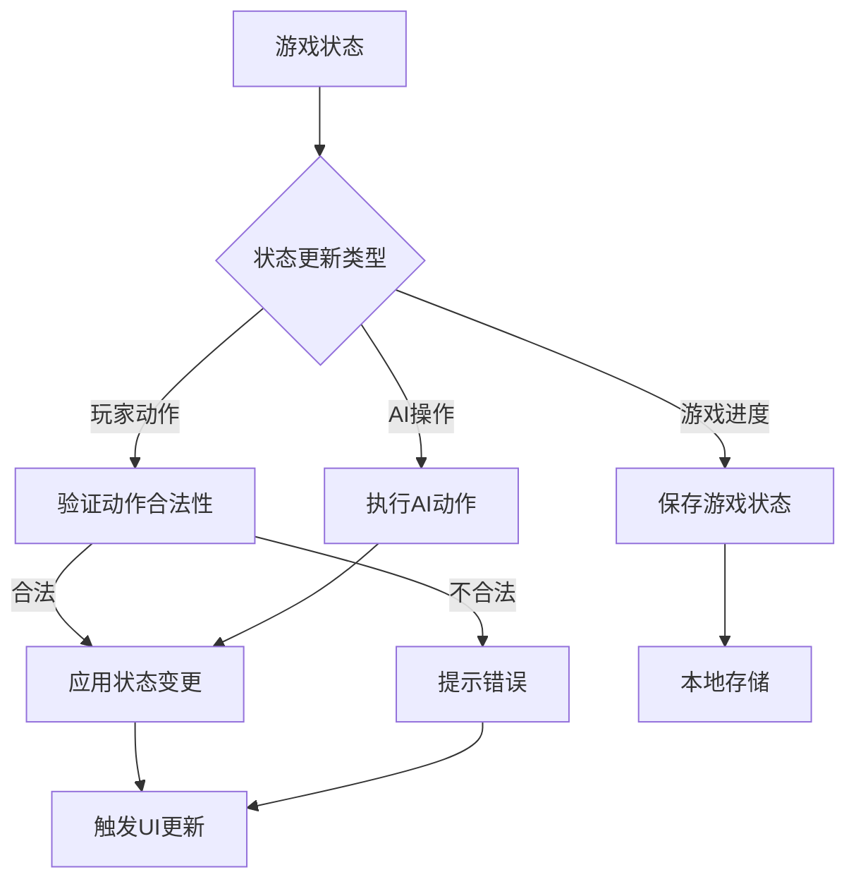
```mermaid
graph TD
    A[游戏状态] --> B{状态更新类型}
    B -->|玩家动作| C[验证动作合法性]
    B -->|游戏进度| D[保存游戏状态]
    B -->|AI操作| E[执行AI动作]
    
    C -->|合法| F[应用状态变更]
    C -->|不合法| G[提示错误]
    
    D --> H[本地存储]
    
    E --> F
    
    F --> I[触发UI更新]
    G --> I
```

## 5. 网络同步流程（计划中）

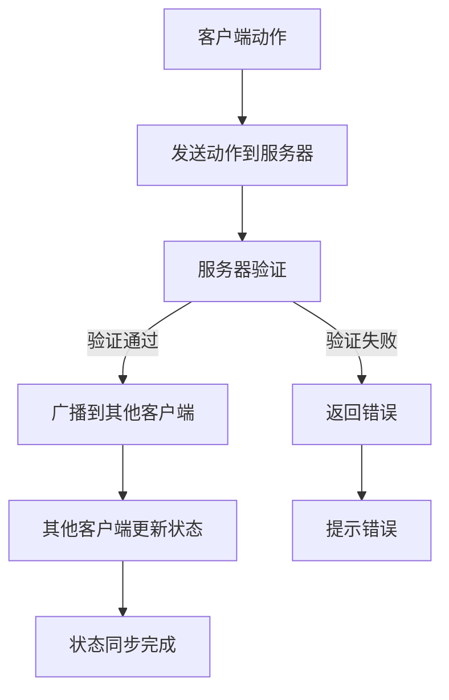
```mermaid
graph TD
    A[客户端动作] --> B[发送动作到服务器]
    B --> C[服务器验证]
    C -->|验证通过| D[广播到其他客户端]
    C -->|验证失败| E[返回错误]
    D --> F[其他客户端更新状态]
    E --> G[提示错误]
    F --> H[状态同步完成]
```

## 6. 数据存储流程（计划中）

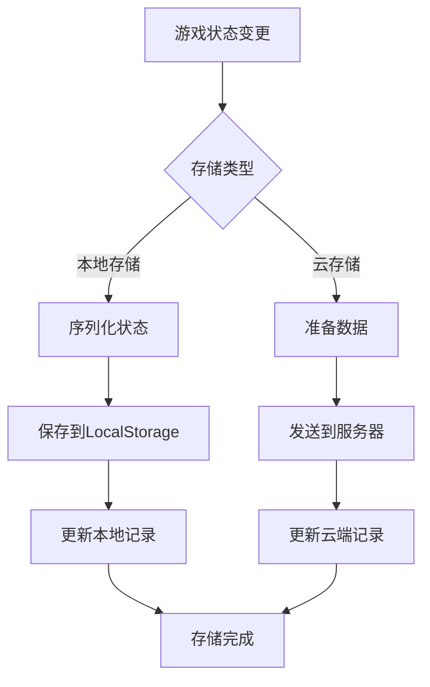
```mermaid
graph TD
    A[游戏状态变更] --> B{存储类型}
    B -->|本地存储| C[序列化状态]
    B -->|云存储| D[准备数据]
    
    C --> E[保存到LocalStorage]
    D --> F[发送到服务器]
    
    E --> G[更新本地记录]
    F --> H[更新云端记录]
    
    G --> I[存储完成]
    H --> I
```

## 7. 组件更新流程

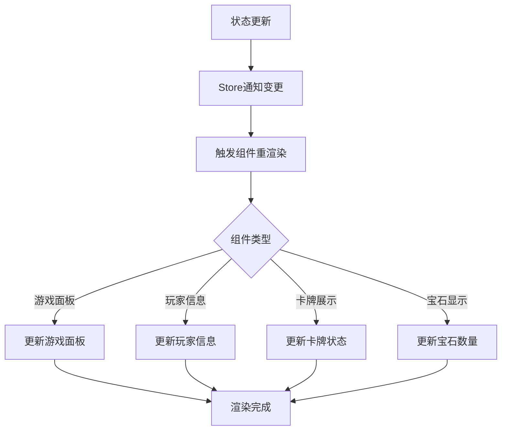
```mermaid
graph TD
    A[状态更新] --> B[Store通知变更]
    B --> C[触发组件重渲染]
    C --> D{组件类型}
    D -->|游戏面板| E[更新游戏面板]
    D -->|玩家信息| F[更新玩家信息]
    D -->|卡牌展示| G[更新卡牌状态]
    D -->|宝石显示| H[更新宝石数量]
    E --> I[渲染完成]
    F --> I
    G --> I
    H --> I
```

# 游戏流程详细设计

## 1. 游戏初始化流程

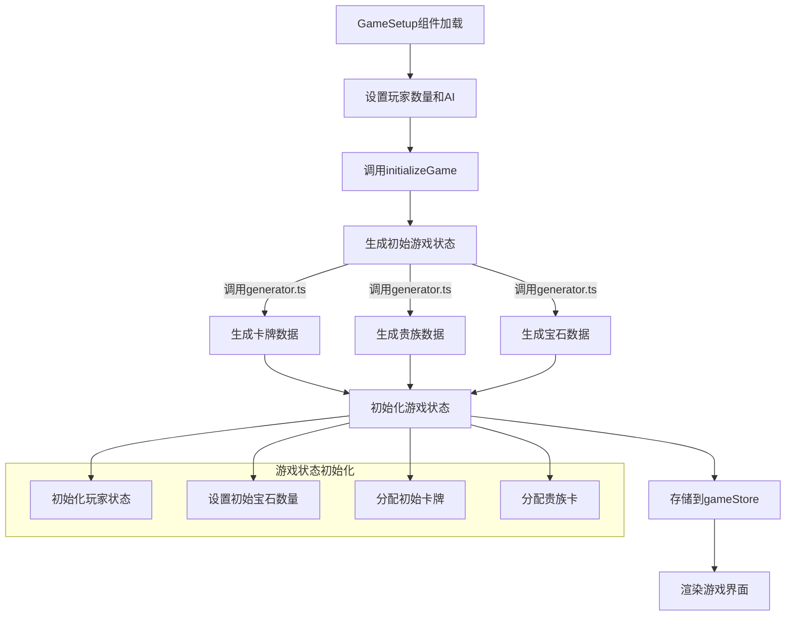
```mermaid
graph TD
    A[GameSetup组件加载] --> B[设置玩家数量和AI]
    B --> C[调用initializeGame]
    C --> D[生成初始游戏状态]
    D --> |调用generator.ts| E[生成卡牌数据]
    D --> |调用generator.ts| F[生成贵族数据]
    D --> |调用generator.ts| G[生成宝石数据]
    E --> H[初始化游戏状态]
    F --> H
    G --> H
    H --> I[存储到gameStore]
    I --> J[渲染游戏界面]

    subgraph 游戏状态初始化
        K[初始化玩家状态]
        L[设置初始宝石数量]
        M[分配初始卡牌]
        N[分配贵族卡]
    end

    H --> K
    H --> L
    H --> M
    H --> N
```

## 2. 玩家操作详细流程

### 2.1 宝石收集流程

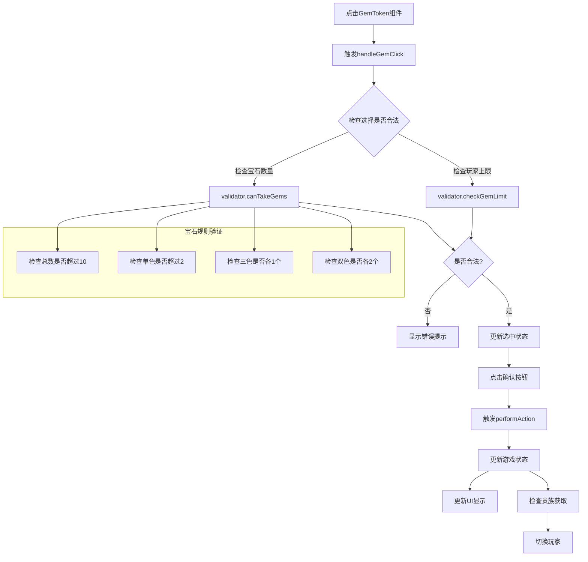
```mermaid
graph TD
    A[点击GemToken组件] --> B[触发handleGemClick]
    B --> C{检查选择是否合法}
    C --> |检查宝石数量| D[validator.canTakeGems]
    C --> |检查玩家上限| E[validator.checkGemLimit]
    
    D --> F{是否合法?}
    E --> F
    F -->|否| G[显示错误提示]
    F -->|是| H[更新选中状态]
    
    H --> I[点击确认按钮]
    I --> J[触发performAction]
    J --> K[更新游戏状态]
    K --> L[更新UI显示]
    K --> M[检查贵族获取]
    M --> N[切换玩家]

    subgraph 宝石规则验证
        O[检查总数是否超过10]
        P[检查单色是否超过2]
        Q[检查三色是否各1个]
        R[检查双色是否各2个]
    end

    D --> O
    D --> P
    D --> Q
    D --> R
```

### 2.2 购买卡牌流程

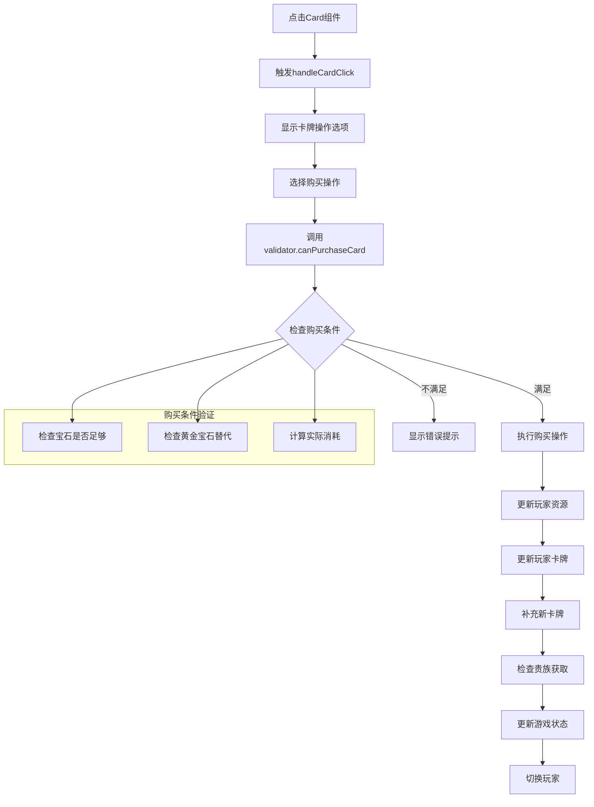
```mermaid
graph TD
    A[点击Card组件] --> B[触发handleCardClick]
    B --> C[显示卡牌操作选项]
    C --> D[选择购买操作]
    D --> E[调用validator.canPurchaseCard]
    
    E --> F{检查购买条件}
    F -->|不满足| G[显示错误提示]
    F -->|满足| H[执行购买操作]
    
    H --> I[更新玩家资源]
    I --> J[更新玩家卡牌]
    J --> K[补充新卡牌]
    K --> L[检查贵族获取]
    L --> M[更新游戏状态]
    M --> N[切换玩家]

    subgraph 购买条件验证
        O[检查宝石是否足够]
        P[检查黄金宝石替代]
        Q[计算实际消耗]
    end

    F --> O
    F --> P
    F --> Q
```

### 2.3 预留卡牌流程

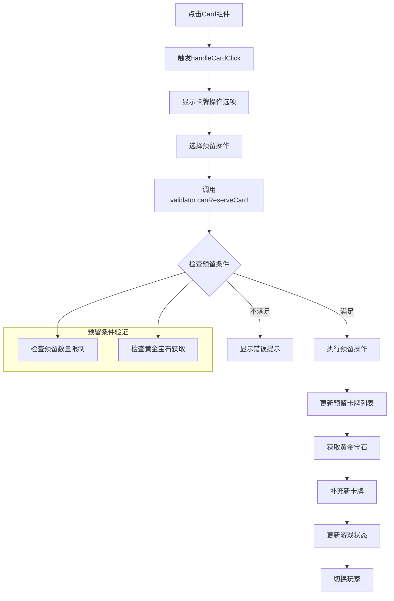
```mermaid
graph TD
    A[点击Card组件] --> B[触发handleCardClick]
    B --> C[显示卡牌操作选项]
    C --> D[选择预留操作]
    D --> E[调用validator.canReserveCard]
    
    E --> F{检查预留条件}
    F -->|不满足| G[显示错误提示]
    F -->|满足| H[执行预留操作]
    
    H --> I[更新预留卡牌列表]
    I --> J[获取黄金宝石]
    J --> K[补充新卡牌]
    K --> L[更新游戏状态]
    L --> M[切换玩家]

    subgraph 预留条件验证
        N[检查预留数量限制]
        O[检查黄金宝石获取]
    end

    F --> N
    F --> O
```

## 3. AI决策详细流程

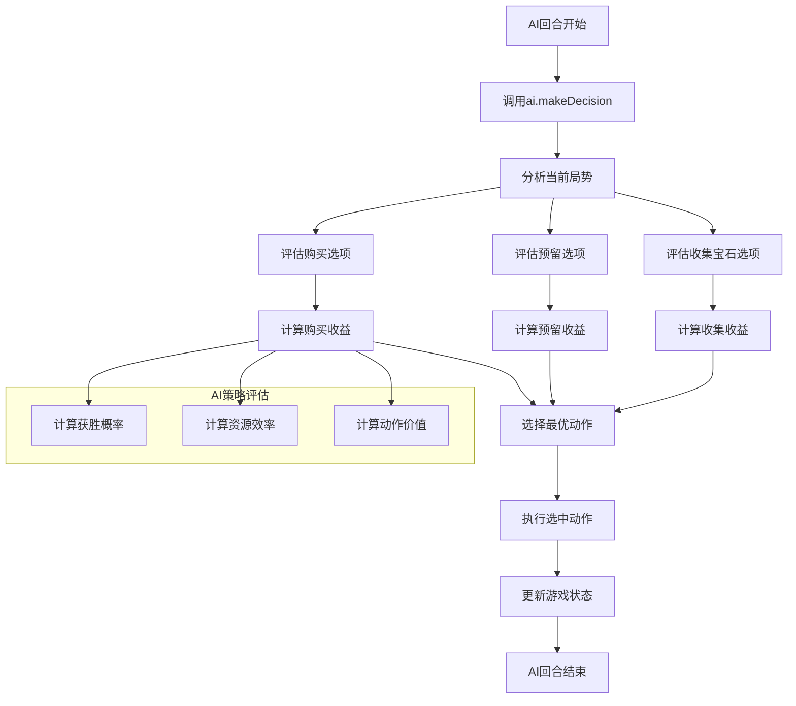
```mermaid
graph TD
    A[AI回合开始] --> B[调用ai.makeDecision]
    B --> C[分析当前局势]
    
    C --> D[评估购买选项]
    C --> E[评估预留选项]
    C --> F[评估收集宝石选项]
    
    D --> G[计算购买收益]
    E --> H[计算预留收益]
    F --> I[计算收集收益]
    
    G --> J[选择最优动作]
    H --> J
    I --> J
    
    J --> K[执行选中动作]
    K --> L[更新游戏状态]
    L --> M[AI回合结束]

    subgraph AI策略评估
        N[计算获胜概率]
        O[计算资源效率]
        P[计算动作价值]
    end

    G --> N
    G --> O
    G --> P
```

## 4. 游戏状态管理详细流程

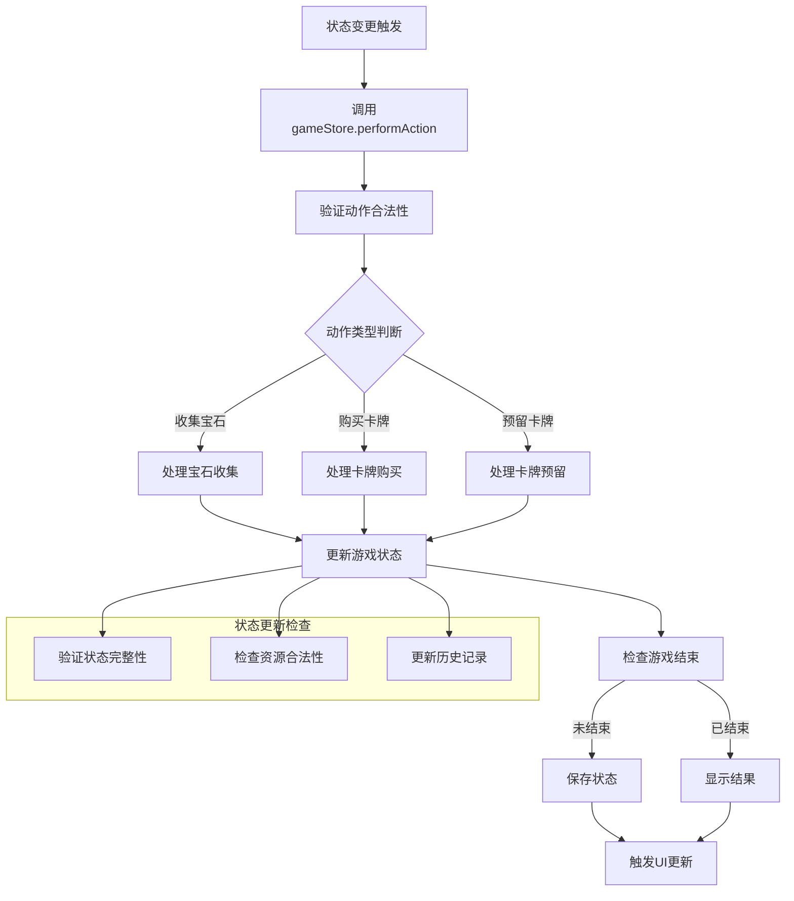
```mermaid
graph TD
    A[状态变更触发] --> B[调用gameStore.performAction]
    B --> C[验证动作合法性]
    C --> D{动作类型判断}
    
    D -->|收集宝石| E[处理宝石收集]
    D -->|购买卡牌| F[处理卡牌购买]
    D -->|预留卡牌| G[处理卡牌预留]
    
    E --> H[更新游戏状态]
    F --> H
    G --> H
    
    H --> I[检查游戏结束]
    I -->|未结束| J[保存状态]
    I -->|已结束| K[显示结果]
    
    J --> L[触发UI更新]
    K --> L

    subgraph 状态更新检查
        M[验证状态完整性]
        N[检查资源合法性]
        O[更新历史记录]
    end

    H --> M
    H --> N
    H --> O
```

## 5. 组件更新详细流程

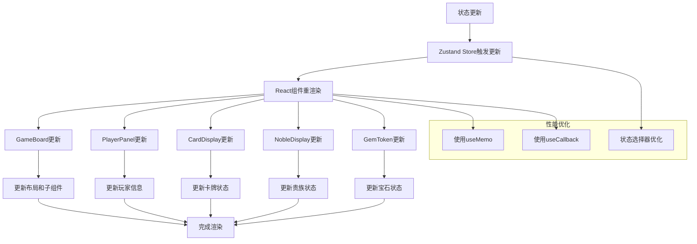
```mermaid
graph TD
    A[状态更新] --> B[Zustand Store触发更新]
    B --> C[React组件重渲染]
    
    C --> D[GameBoard更新]
    C --> E[PlayerPanel更新]
    C --> F[CardDisplay更新]
    C --> G[NobleDisplay更新]
    C --> H[GemToken更新]
    
    D --> I[更新布局和子组件]
    E --> J[更新玩家信息]
    F --> K[更新卡牌状态]
    G --> L[更新贵族状态]
    H --> M[更新宝石状态]
    
    I --> N[完成渲染]
    J --> N
    K --> N
    L --> N
    M --> N

    subgraph 性能优化
        O[使用useMemo]
        P[使用useCallback]
        Q[状态选择器优化]
    end

    C --> O
    C --> P
    B --> Q
```

## 6. 贵族获取流程

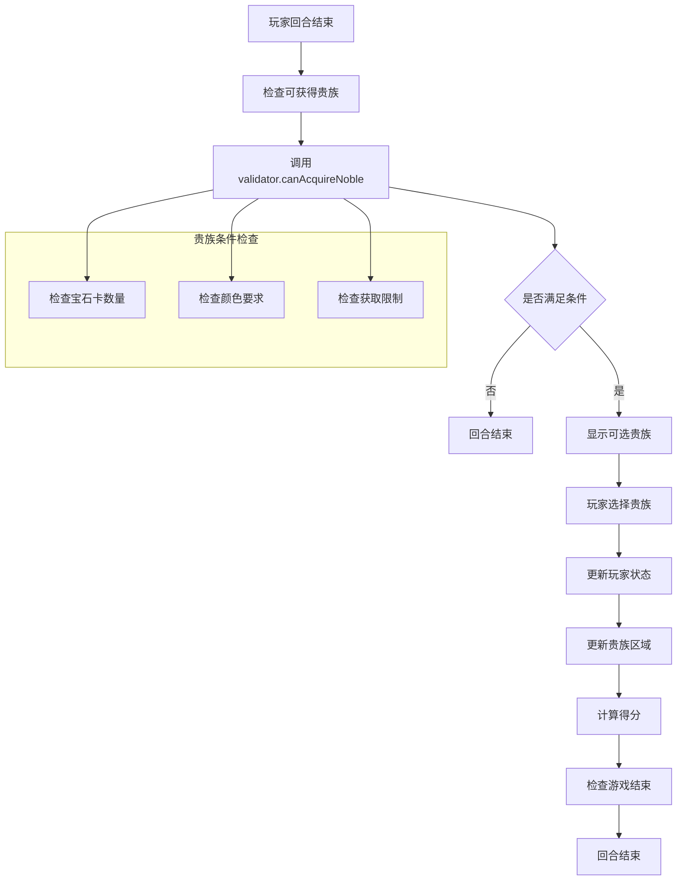
```mermaid
graph TD
    A[玩家回合结束] --> B[检查可获得贵族]
    B --> C[调用validator.canAcquireNoble]
    
    C --> D{是否满足条件}
    D -->|否| E[回合结束]
    D -->|是| F[显示可选贵族]
    
    F --> G[玩家选择贵族]
    G --> H[更新玩家状态]
    H --> I[更新贵族区域]
    I --> J[计算得分]
    J --> K[检查游戏结束]
    K --> L[回合结束]

    subgraph 贵族条件检查
        M[检查宝石卡数量]
        N[检查颜色要求]
        O[检查获取限制]
    end

    C --> M
    C --> N
    C --> O
```

## 7. 游戏结束判定流程

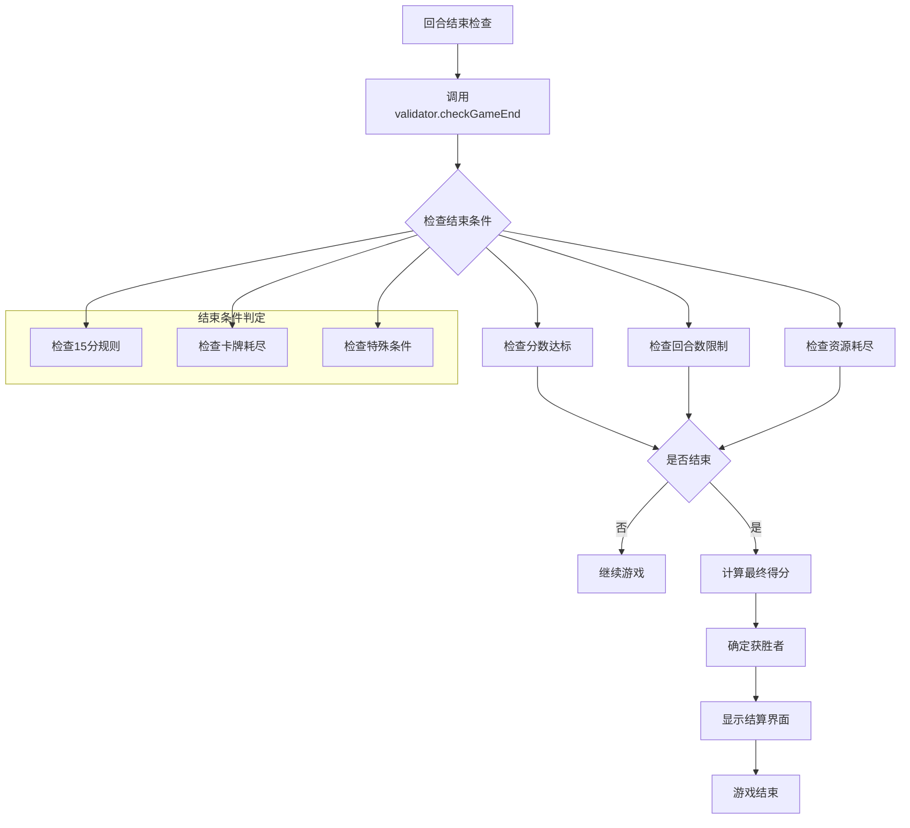
```mermaid
graph TD
    A[回合结束检查] --> B[调用validator.checkGameEnd]
    
    B --> C{检查结束条件}
    C --> D[检查分数达标]
    C --> E[检查回合数限制]
    C --> F[检查资源耗尽]
    
    D --> G{是否结束}
    E --> G
    F --> G
    
    G -->|否| H[继续游戏]
    G -->|是| I[计算最终得分]
    
    I --> J[确定获胜者]
    J --> K[显示结算界面]
    K --> L[游戏结束]

    subgraph 结束条件判定
        M[检查15分规则]
        N[检查卡牌耗尽]
        O[检查特殊条件]
    end

    C --> M
    C --> N
    C --> O
```

每个流程图都详细展示了代码中的具体实现流程，包括：
1. 组件调用关系
2. 数据流转过程
3. 状态更新机制
4. 验证规则实现
5. 性能优化考虑
6. 错误处理流程

这些流程图可以帮助开发者更好地理解代码的执行过程，以及各个模块之间的交互关系。 